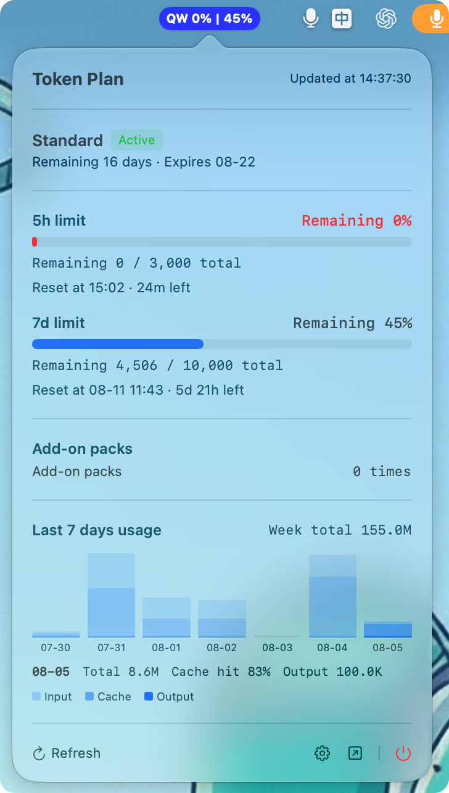

# TokenBoard

[简体中文](README.md) | [English](README.en.md)

A lightweight macOS menu bar tool that monitors your **Qwen Token Plan** quota consumption in real time. See the remaining quota of the 5-hour / 7-day sliding windows at a glance.



## Features

- **Menu bar capsule**: `QW 5h% | 7d%` dual percentages, both windows' remaining quota at a glance
- **5h / 7d sliding windows**: remaining ratio, remaining calls, reset countdown
- **Last 7 days usage trend**: day-by-day stacked bar chart (input / cache / output), click to see daily totals and cache hit rate
- **Plan info**: tier, status, remaining days, expiry date
- **Add-on packs**: remaining add-on pack info
- **Quota alert**: system notification when remaining drops below 20%
- **Customizable style**: configurable capsule background color, applied instantly
- **Secure storage**: Cookie and sec_token stored in the macOS Keychain
- **One-click quit**: power button at the bottom-right of the popover

## Installation

Download `TokenBoard-0.1.4-universal.dmg` from [Releases](https://github.com/icepoper/tokenboard/releases):

1. Open the DMG and drag TokenBoard into Applications
2. **First launch** (unsigned app): right-click the app -> **Open**, or go to System Settings -> Privacy & Security -> **Open Anyway**
3. After launching, the TokenBoard icon appears in the menu bar

## Usage

1. Click the TokenBoard icon in the menu bar -> **Settings**
2. Grab your credentials from the browser:
   - Open the [Qwen Token Plan page](https://platform.qianwenai.com/home/billing/subscription/token-plan-individual)
   - Press `F12` -> Network -> reload the page -> pick any request
   - Copy the whole `Cookie` line from the **Headers** tab
   - Copy `sec_token` from the **Payload** tab
3. Paste them into the Settings window and save; data starts refreshing in real time

## Development

```bash
# Generate the Xcode project (requires XcodeGen)
brew install xcodegen
xcodegen generate

# Build
xcodebuild -project TokenBoard.xcodeproj -scheme TokenBoard -configuration Release build

# Package DMG
hdiutil create -volname "TokenBoard" -srcfolder <app-folder> -ov -format UDZO TokenBoard.dmg
```

### Tech stack

- Swift 5.9+ / SwiftUI
- macOS 13.0+ (Apple Silicon & Intel)
- Zero third-party dependencies

### Project structure

```
TokenBoard/
├── TokenBoardApp.swift          # App entry
├── Models/                      # Data models
├── Services/                    # API client / polling / status bar
├── Views/                       # Menu bar / popover / settings
├── Utilities/                   # Keychain / notifications / settings
└── Assets.xcassets              # App icon
```

## Disclaimer

This project reads data through **unofficial Qwen workbench APIs** for personal learning only. APIs may change at any time; the author is not responsible for data accuracy. Please comply with Alibaba Cloud's terms of service.

## License

[MIT](LICENSE)
