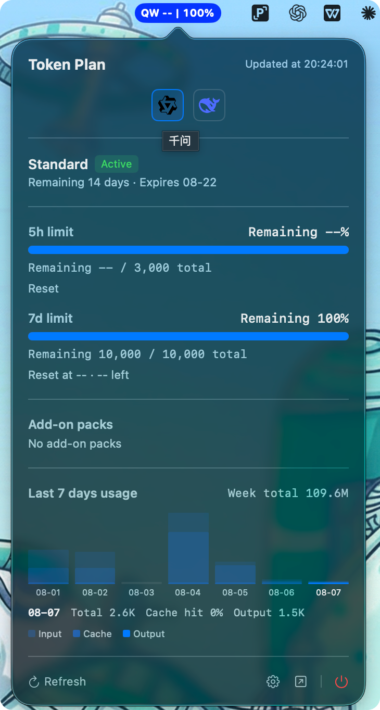
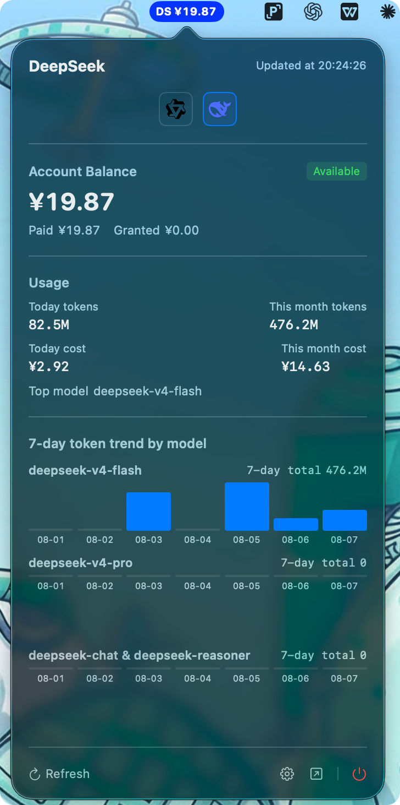

# TokenBoard

[简体中文](README.md) | [English](README.en.md)

A lightweight macOS menu bar tool that monitors **Qwen Token Plan** and **DeepSeek** usage / balance in real time. Switch providers with one click on their official logos; quotas and balances at a glance.





## Features

- **Multi-provider switching**: switch between Qianwen and DeepSeek with one click on their official logos in the popover / settings; the choice is persisted
- **Qianwen monitoring**: `QW 5h% | 7d%` dual percentages, remaining calls and reset countdown, last-7-days usage trend, plan info, add-on packs
- **DeepSeek monitoring**: `DS ¥balance`, paid / granted / total balance, today & month tokens / cost / request counts, 7-day per-model token trend charts (one chart per model)
- **Quota / balance alerts**: system notification when Qianwen remaining drops below 20% or DeepSeek balance below 20 CNY
- **Customizable style**: configurable capsule background color, applied instantly
- **Secure storage**: Qianwen Cookie / sec_token and DeepSeek userToken stored in the macOS Keychain
- **One-click quit**: power button at the bottom-right of the popover

## Installation

Download `TokenBoard-0.2.0-universal.dmg` from [Releases](https://github.com/icepoper/tokenboard/releases):

1. Open the DMG and drag TokenBoard into Applications
2. **First launch** (unsigned app): right-click the app -> **Open**, or go to System Settings -> Privacy & Security -> **Open Anyway**
3. After launching, the TokenBoard icon appears in the menu bar

## Usage

1. Click the TokenBoard icon in the menu bar -> **Settings** -> click a provider logo to select which one to monitor
2. Configure the credentials for that provider:
   - **Qianwen**: open the [Qwen Token Plan page](https://platform.qianwenai.com/home/billing/subscription/token-plan-individual), press `F12` -> Network -> reload -> pick any request -> copy the whole `Cookie` line from the **Headers** tab and `sec_token` from the **Payload** tab
   - **DeepSeek**: sign in to [platform.deepseek.com](https://platform.deepseek.com) in Chrome, press `Cmd+Option+I` -> **Console** -> run `localStorage.getItem('userToken')` -> copy the `value` field from the output (NOT the `sk-` API key)
3. Paste them into the Settings window and save; data starts refreshing in real time

## Development

```bash
# Generate the Xcode project (requires XcodeGen)
brew install xcodegen
xcodegen generate

# Build
xcodebuild -project TokenBoard.xcodeproj -scheme TokenBoard -configuration Release build

# Package DMG
hdiutil create -volname "TokenBoard" -srcfolder <app-folder> -ov -format UDZO TokenBoard.dmg
```

### Tech stack

- Swift 5.9+ / SwiftUI
- macOS 13.0+ (Apple Silicon & Intel)
- Zero third-party dependencies

### Project structure

```
TokenBoard/
├── TokenBoardApp.swift          # App entry
├── Models/                      # Data models
├── Services/                    # Provider abstraction / API clients / polling / status bar
├── Views/                       # Menu bar / popover / settings / provider switcher
├── Utilities/                   # Keychain / notifications / settings
└── Assets.xcassets              # App icon
```

## Disclaimer

This project reads data through **unofficial Qwen workbench and DeepSeek platform APIs** for personal learning only. APIs may change at any time; the author is not responsible for data accuracy. Please comply with the relevant terms of service.

## Changelog

[CHANGELOG.en.md](CHANGELOG.en.md)

## License

[MIT](LICENSE)
