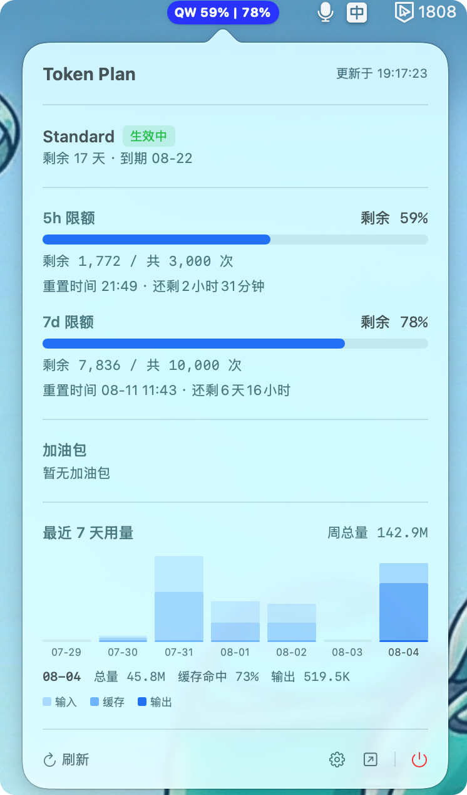

# TokenBoard ⚡

macOS 菜单栏实时监控**千问（Qwen）Token Plan** 额度消耗的轻量工具。5 小时 / 7 天滑动窗口的剩余额度一眼可见。



## ✨ 功能

- **菜单栏胶囊**：`QW 5h剩余% | 7d剩余%` 双百分比，两个周期剩余额度一目了然
- **5h / 7d 滑动窗口**：剩余比例、剩余次数、重置倒计时
- **最近 7 天用量趋势**：按天堆叠柱状图（输入 / 缓存 / 输出），点击查看单日总量与缓存命中率
- **套餐信息**：等级、状态、剩余天数、到期时间
- **加油包**：剩余加油包信息
- **额度预警**：剩余低于 20% 时发送系统通知
- **自定义样式**：胶囊背景颜色可配置，实时生效
- **安全存储**：Cookie 与 sec_token 存入 macOS Keychain
- **一键退出**：弹出面板右下角电源按钮

## 📦 安装

从 [Releases](https://github.com/icepoper/tokenboard/releases) 下载 `TokenBoard-0.1.4-universal.dmg`：

1. 打开 DMG，把 TokenBoard 拖入 Applications
2. **首次打开**（未签名应用）：右键点击 app → **打开**，或到 系统设置 → 隐私与安全性 → **仍要打开**
3. 打开 app 后，菜单栏出现 TokenBoard 图标

## 🚀 使用

1. 点击菜单栏 TokenBoard 图标 → **设置**（⚙️）
2. 从浏览器抓取凭证：
   - 打开 [千问 Token Plan 页面](https://platform.qianwenai.com/home/billing/subscription/token-plan-individual)
   - 按 `F12` → Network → 刷新页面 → 任选一个请求
   - **Headers** 标签复制 `Cookie` 整行
   - **Payload** 标签复制 `sec_token`
3. 粘贴到设置窗口并保存，数据开始实时刷新

## 🛠 开发

```bash
# 生成 Xcode 项目（需 XcodeGen）
brew install xcodegen
xcodegen generate

# 构建
xcodebuild -project TokenBoard.xcodeproj -scheme TokenBoard -configuration Release build

# 打包 DMG
hdiutil create -volname "TokenBoard" -srcfolder <app目录> -ov -format UDZO TokenBoard.dmg
```

### 技术栈

- Swift 5.9+ / SwiftUI
- macOS 13.0+（Apple Silicon & Intel）
- 零第三方依赖

### 项目结构

```
TokenBoard/
├── TokenBoardApp.swift          # App 入口
├── Models/                      # 数据模型
├── Services/                    # API 客户端 / 轮询 / 状态栏
├── Views/                       # 菜单栏 / 弹出面板 / 设置
├── Utilities/                   # Keychain / 通知 / 设置
└── Assets.xcassets              # 应用图标
```

## ⚠️ 免责声明

本项目通过**逆向千问工作台内部 API** 获取数据，仅供个人学习使用。接口可能随时变更，作者不对数据准确性负责。请遵守阿里云服务条款，合理使用。

## 📄 License

[MIT](LICENSE)
