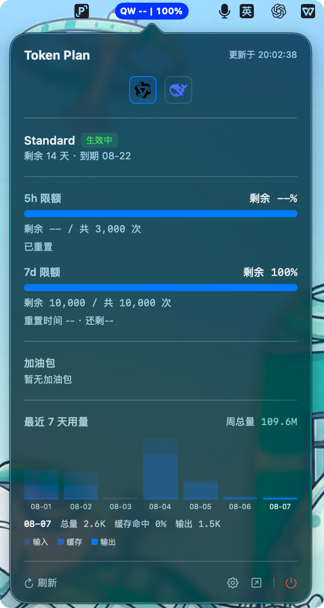
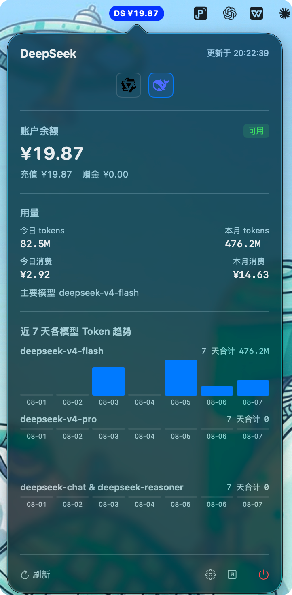

# TokenBoard

[English](README.en.md) | [简体中文](README.md)

macOS 菜单栏实时监控**千问（Qwen）Token Plan** 与 **DeepSeek** 用量 / 余额的轻量工具。官方 logo 一键切换服务商，额度与余额一眼可见。





## 功能

- **多服务商切换**：弹出面板 / 设置页用官方 logo 一键切换千问与 DeepSeek，选择持久化
- **千问监控**：`QW 5h剩余% | 7d剩余%` 双百分比、剩余次数与重置倒计时、最近 7 天用量趋势、套餐信息、加油包
- **DeepSeek 监控**：`DS ¥余额`、充值 / 赠金 / 总余额、今日与本月 tokens / 消费 / 请求数、近 7 天按模型 token 趋势图（多模型多图）
- **额度 / 余额预警**：千问剩余低于 20%、DeepSeek 余额低于 20 元时发送系统通知
- **自定义样式**：胶囊背景颜色可配置，实时生效
- **安全存储**：千问 Cookie / sec_token 与 DeepSeek userToken 存入 macOS Keychain
- **一键退出**：弹出面板右下角电源按钮

## 安装

从 [Releases](https://github.com/icepoper/tokenboard/releases) 下载 `TokenBoard-0.2.0-universal.dmg`：

1. 打开 DMG，把 TokenBoard 拖入 Applications
2. **首次打开**（未签名应用）：右键点击 app → **打开**，或到 系统设置 → 隐私与安全性 → **仍要打开**
3. 打开 app 后，菜单栏出现 TokenBoard 图标

## 使用

1. 点击菜单栏 TokenBoard 图标 → **设置** → 点击服务商 logo 选择要监控的服务商
2. 配置对应服务商凭证：
   - **千问**：打开[千问 Token Plan 页面](https://platform.qianwenai.com/home/billing/subscription/token-plan-individual)，按 `F12` → Network → 刷新页面 → 任选一个请求 → **Headers** 标签复制 `Cookie` 整行、**Payload** 标签复制 `sec_token`
   - **DeepSeek**：Chrome 登录 [platform.deepseek.com](https://platform.deepseek.com)，按 `Cmd+Option+I` → **Console** → 输入 `localStorage.getItem('userToken')` 回车 → 复制输出的 `value` 字段（不是 `sk-` 开头的 API Key）
3. 粘贴到设置窗口并保存，数据开始实时刷新

## 开发

```bash
# 生成 Xcode 项目（需 XcodeGen）
brew install xcodegen
xcodegen generate

# 构建
xcodebuild -project TokenBoard.xcodeproj -scheme TokenBoard -configuration Release build

# 打包 DMG
hdiutil create -volname "TokenBoard" -srcfolder <app目录> -ov -format UDZO TokenBoard.dmg
```

### 技术栈

- Swift 5.9+ / SwiftUI
- macOS 13.0+（Apple Silicon & Intel）
- 零第三方依赖

### 项目结构

```
TokenBoard/
├── TokenBoardApp.swift          # App 入口
├── Models/                      # 数据模型
├── Services/                    # Provider 抽象 / API 客户端 / 轮询 / 状态栏
├── Views/                       # 菜单栏 / 弹出面板 / 设置 / 服务商切换
├── Utilities/                   # Keychain / 通知 / 设置
└── Assets.xcassets              # 应用图标
```

## 免责声明

本项目通过**逆向千问工作台与 DeepSeek 平台内部 API** 获取数据，仅供个人学习使用。接口可能随时变更，作者不对数据准确性负责。请遵守相关服务条款，合理使用。

## 更新日志

[CHANGELOG.md](CHANGELOG.md)

## License

[MIT](LICENSE)
